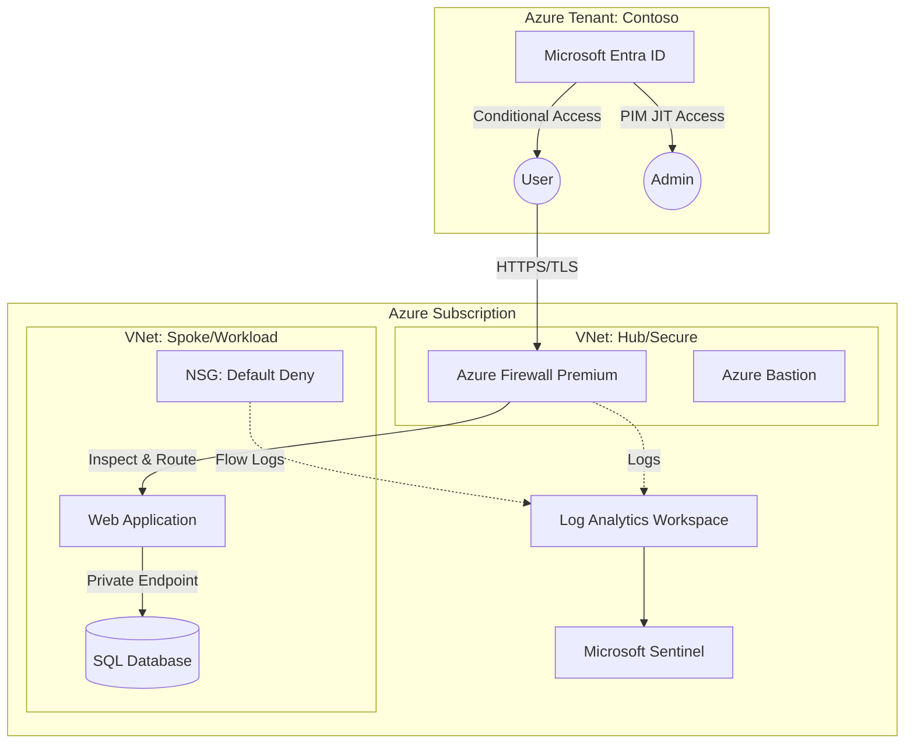

# Azure Zero Trust Architecture

[](https://github.com/sammyonyekwere/Azure-Zero-Trust-Architecture/actions/workflows/deploy.yml)
[](https://opensource.org/licenses/MIT)
[](https://learn.microsoft.com/en-us/azure/azure-resource-manager/bicep/)

> **Portfolio Project**: A production-ready reference implementation of Zero Trust principles in Microsoft Azure, demonstrating Infrastructure as Code (IaC), Network Security, and Identity Governance.

## 📖 Executive Summary

This repository demonstrates an enterprise-grade secure infrastructure based on the **Microsoft Zero Trust model**: *Verify Explicitly, Use Least Privileged Access, and Assume Breach*.

Unlike standard implementations, this project focuses on **defense-in-depth**, utilizing Azure Firewall Premium for IDPS, enforcing micro-segmentation via NSGs, and laying the groundwork for automated threat response with Microsoft Sentinel.

## 🏗️ Architecture



## 🛠️ Technology Stack

*   **Infrastructure as Code**: Azure Bicep (Modularized design)
*   **CI/CD**: GitHub Actions (Validation, What-If analysis, Automated Deployment)
*   **Network Security**:
    *   Azure Firewall Premium (TLS Inspection, IDPS)
    *   Private Endpoints (PaaS isolation)
    *   Micro-segmentation (NSG Default Deny)
*   **Identity & Governance**:
    *   Microsoft Entra ID (Conditional Access)
    *   Privileged Identity Management (PIM)
*   **SecOps**:
    *   Microsoft Sentinel (SIEM/SOAR)
    *   Azure Monitor (Log Analytics)

## 📂 Repository Structure

This project follows the **Azure Well-Architected Framework** structure:

```text
/
├── .github/workflows/   # CI/CD Pipelines with OIDC authentication
├── infra/               # Bicep Infrastructure Code
│   ├── modules/         # Reusable modules (Network, Security, Identity)
│   └── main.bicep       # Orchestrator for region-agnostic deployment
├── scripts/             # PowerShell automation for Identity/Governance
└── README.md            # System documentation
```

## 🚀 Key Features

### 1. Zero Trust Network Access (ZTNA)
*   **Micro-segmentation**: All subnets are isolated by default. Traffic is explicitly allowed only where necessary.
*   **Perimeter Security**: All ingress/egress traffic is filtered through Azure Firewall Premium.

### 2. Identity-First Security
*   **Conditional Access**: Scripted policies to enforce MFA for all privileged roles (see `scripts/configure-identity.ps1`).
*   **JIT Access**: Guidance for implementing Privileged Identity Management to reduce attack surface.

### 3. Automated Observability
*   **Sentinel Integration**: Infrastructure automatically connects to Microsoft Sentinel for real-time threat detection.
*   **Centralized Logging**: Diagnostic settings for all resources are routed to a single Log Analytics workspace.

## 💻 Getting Started

### Prerequisites
*   Azure Subscription (Free Tier works for most components, but Firewall is paid)
*   Azure CLI (`az login`)
*   GitHub Account

### Deployment Instructions

**Option 1: One-Click Deploy (Local)**
```bash
# Clone the repository
git clone https://github.com/sammyonyekwere/Azure-Zero-Trust-Architecture.git

# Navigate to the directory
cd Azure-Zero-Trust-Architecture

# Deploy resources
az deployment sub create \
  --location eastus \
  --template-file infra/main.bicep \
  --parameters prefix=zt-demo
```

**Option 2: GitHub Actions (CI/CD)**
1.  Fork this repository.
2.  Configure Azure OIDC or Service Principal secrets (`AZURE_CLIENT_ID`, etc.).
3.  Push to `main` to trigger the **Deploy Zero Trust Architecture** workflow.

## 🔮 Future Roadmap

*   [ ] integration with **Azure Policy** for regulatory compliance (NIST 800-53).
*   [ ] Add **Terraform** alternative for multi-cloud demonstration.
*   [ ] Implement **DevSevOps** utilizing GitHub Advanced Security.
